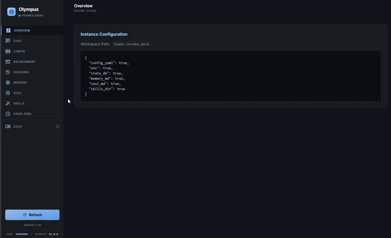

# 🏛️ Olympus

An interactive UI dashboard for the Hermes Agent ecosystem.

[](https://opensource.org/licenses/MIT)
[](https://www.python.org/downloads/)
[](https://fastapi.tiangolo.com/)
[](https://tailwindcss.com/)

<div align="center">
  
</div>
---

### Project Status: Experimental
> **Disclaimer:** This is an unofficial, experimental project created for my learning of agentic systems and orchestration. It is **not affiliated** with NousResearch. Provided as-is.

## Overview

**Olympus** bridges the gap between the powerful Hermes Agent CLI and a modern web interface. While the CLI is robust, Olympus provides a "God's eye view" of your local `~/.hermes` environment, allowing for real-time interaction and state management.

### Key Enhancements:
* **Two-Way Chat:** Full interactive session support (not just read-only).
* **State Visualization:** Live polling of active memory and environment variables.
* **Skill Management:** Toggle and inspect agent skills via a clean UI.
* **Zero-Config Setup:** Automated environment provisioning.

---

## 🛠️ Core Tech Stack

| Layer | Technology | Purpose |
| :--- | :--- | :--- |
| **Backend** | FastAPI / Python | Subprocess orchestration & JSON-RPC bridging |
| **Frontend** | Vanilla JS / Tailwind | Lightweight, responsive interface |
| **Markdown** | Marked.js | Real-time rendering of agent responses |

---

## 🚀 Getting Started

### Prerequisites
- **OS:** Linux, macOS, or WSL2 (Hermes requires a Unix-like environment).
- **Python:** 3.10 or higher.
- **Hermes:** A configured [Hermes Agent](https://github.com/NousResearch/hermes-agent) installation.

### Installation & Launch
1. **Clone the repository:**
   ```bash
   git clone https://github.com/gusperroni/Olympus.git
   cd Olympus
   ```

2. **Run the bootstrap script:**
   This script creates a virtual environment, installs dependencies, and starts the server.
   ```bash
   chmod +x start.sh
   ./start.sh
   ```

3. **Access the Dashboard:**
   Navigate to **http://127.0.0.1:8787** in your browser.

---

## Built via Agentic Orchestration

The entire codebase was engineered through a **3-Layer Domain-Driven Design (DDD)** methodology utilizing an AI-assisted orchestration loop:

1. **Strategic Intent:** Business logic and aesthetics (build with the help of [Stitch](https://stitch.withgoogle.com/)) were dictated through high-level markdown directives.
2. **Deterministic TDD Execution:** Every backend feature was written against strict Test-Driven Development mandates. The API endpoint suite currently boasts **87% backend code coverage** executed entirely under automated AI testing sprints.
3. **Self-Annealing Loop:** The orchestration dynamically verified asynchronous states against live CLI models, iterating perfectly until the UX remained cleanly non-blocking.

## Credits
- A huge shoutout to [Mayur](https://github.com/mayurjobanputra/) and his [Hermes Dashboard](https://github.com/mayurjobanputra/hermes-dashboard) work for the initial prompt engineering concepts and "vibe" that helped bootstrap the core logic of Olympus. While I aimed to evolve Olympus into a standalone interactive platform with unique orchestration, Mayur's work was the essential spark for this project.

- [Hermes-Agent ☤](https://github.com/nousresearch/hermes-agent) by [Nous Research](https://nousresearch.com/).


## License
Distributed under the MIT License. See `LICENSE` for more information.